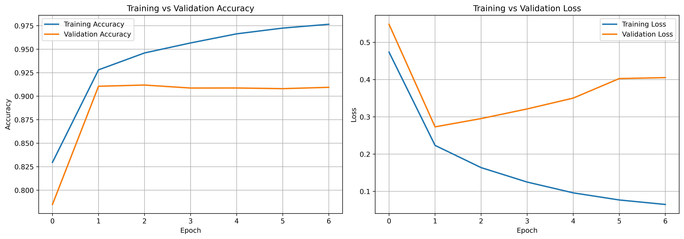
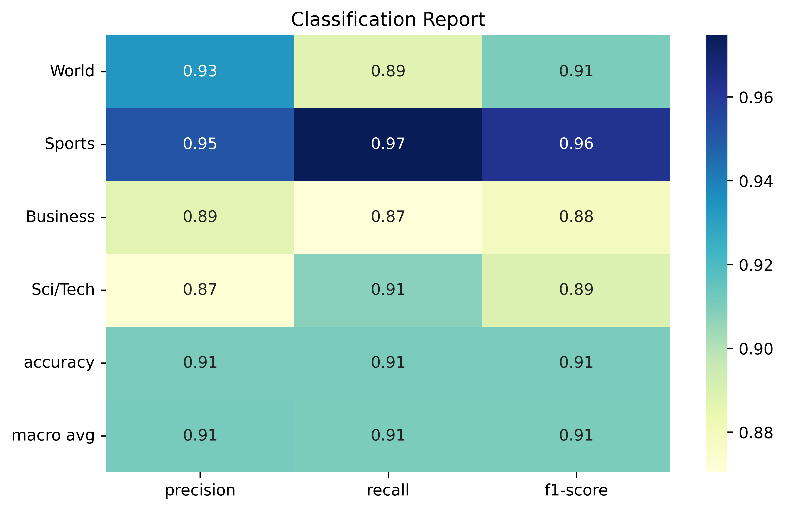
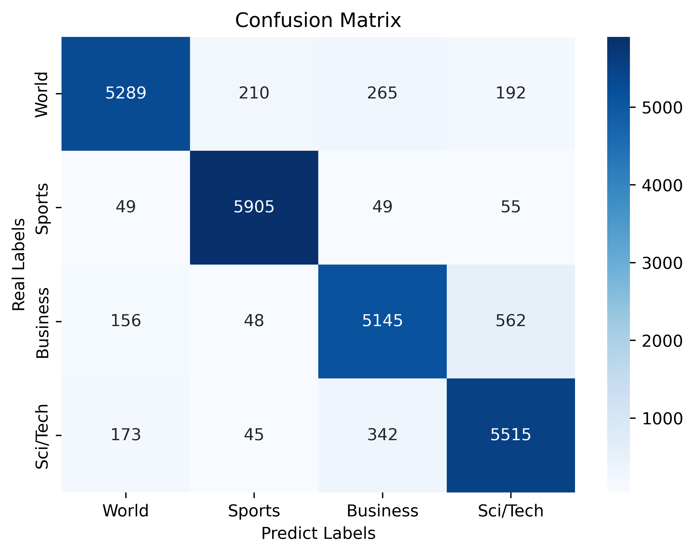

# 🗞️ NewsCortex — AI News Desk


> A TF‑IDF + deep neural network pipeline that reads a raw news headline and instantly files it under the correct desk: **World, Sports, Business, or Sci/Tech.**

Built with **TensorFlow/Keras**, **scikit-learn**, and **Streamlit** — an end‑to‑end text classification project, from feature extraction to a deployed, interactive interface.

**🔗 Live demo:** **[newscortex.streamlit.app](https://newscortex.streamlit.app/)**


## 🎯 What It Does

Paste in a headline or a few lines of an article, and NewsCortex returns:

- The predicted **desk** (category) with a confidence score
- A full probability breakdown across all four classes
- A live, code-driven inspection panel showing the model's actual layers and the vectorizer's actual configuration — not hardcoded docs, read straight from the loaded objects

## 🧠 How It Works

```
Raw text
   │
   ▼
TF-IDF Vectorizer  ──  10,000 features · unigrams + bigrams · sublinear TF · L2 norm
   │
   ▼
Dense Neural Network
   ├─ Dense(256) → BatchNorm → ReLU → Dropout(0.3)
   ├─ Dense(256) → BatchNorm → ReLU
   ├─ Dense(128) → BatchNorm → ReLU → Dropout(0.3)
   ├─ Dense(128) → BatchNorm → ReLU
   ├─ Dense(64)  → BatchNorm → ReLU → Dropout(0.3)
   ├─ Dense(64)  → BatchNorm → ReLU
   └─ Dense(4, softmax)
   │
   ▼
P(World) · P(Sports) · P(Business) · P(Sci/Tech)
```

The network is a deliberately deep **dense (fully-connected) classifier** rather than the bag-of-words count you might expect — six hidden blocks with batch normalization and dropout for regularization, ending in a 4-way softmax.

## 🧬 Understanding Neural Networks, the Easy Way


An **Artificial Neural Network (ANN)** is a machine learning model loosely inspired by how neurons in the brain pass signals to one another. Instead of one giant rulebook, it's built from many small, simple units — called **neurons** — arranged in **layers**:

- **Input layer** — receives the raw numbers that describe the data. In NewsCortex, this is the 10,000-dimensional TF‑IDF vector representing a headline.
- **Hidden layers** — each neuron takes in the values from the previous layer, multiplies them by learned **weights**, adds a **bias**, and passes the result through an **activation function** (ReLU, in this project). This is what lets the network detect increasingly complex patterns, layer after layer, rather than just drawing a straight line through the data.
- **Output layer** — produces the final answer. Here, a **softmax** function turns the last layer's raw scores into four probabilities that sum to 1 — one for each news desk.

**How does it "learn"?** During training, the network makes a prediction, compares it to the true label using a **loss function**, and then uses an algorithm called **backpropagation** to work backward through the network, figuring out how much each weight contributed to the error. An optimizer (like Adam or SGD) then nudges every weight slightly in the direction that reduces that error. Repeat this thousands of times across the training data, and the network gradually learns which words and phrases signal "Sports" versus "Business" versus "Sci/Tech."

📖 For a deeper dive, see IBM's excellent explainer: **[What is a Neural Network? — IBM](https://www.ibm.com/think/topics/neural-networks)**

## 📊 Results

### Accuracy & Loss Curves



Training accuracy climbs steadily toward ~0.98 while validation accuracy levels off around ~0.91 after the first couple of epochs. The loss chart tells the same story: training loss keeps falling, but validation loss bottoms out early and then creeps back up. This is a classic **overfitting** signature — the network keeps memorizing the training set long after it has stopped generalizing better to unseen headlines, which is exactly why techniques like **dropout** and **early stopping** are worth leaning on further in this project.

### Classification Report



The model reaches an overall **91% accuracy**, with precision, recall, and F1-score fairly balanced across classes. **Sports** is the easiest desk to call (F1 ≈ 0.96) — sports headlines tend to use very distinctive vocabulary (team names, scores, tournaments). **Business** and **Sci/Tech** are the toughest (F1 ≈ 0.88–0.89), which lines up with real-world intuition: tech-company earnings, IPOs, and product launches often blur the line between "Business" and "Sci/Tech" news.

### Confusion Matrix



The diagonal dominates, confirming the model gets most headlines right. The most notable confusion sits between **Business** and **Sci/Tech**: 562 true Business headlines were predicted as Sci/Tech, and 342 true Sci/Tech headlines were predicted as Business. **Sports**, by contrast, is the cleanest class, with very few headlines leaking into other categories — reinforcing the pattern seen in the classification report.

## 📁 Project Structure

```
news_cortex_app/
├── app.py                      # Streamlit application (fully commented)
├── ag_news_classifier.keras    # Trained Keras model
├── tfidf_vectorizer.pkl        # Fitted scikit-learn TfidfVectorizer
├── requirements.txt            # Pinned dependencies
├── screenshots/                # Result images referenced in this README
│   ├── ann_architecture.png
│   ├── Accuracy_and_loss_curve.png
│   ├── Classification_Report.png
│   └── Confusion_Matrix.png
├── .streamlit/
│   └── config.toml             # Theme (colors/fonts) for the deployed app
└── README.md
```

## 🚀 Run It Locally

```bash
# 1. Clone / open this folder, then create a virtual environment
python -m venv venv
source venv/bin/activate          # Windows: venv\Scripts\activate

# 2. Install dependencies
pip install -r requirements.txt

# 3. Launch the app
streamlit run app.py
```

The app opens at `http://localhost:8501`. The model and vectorizer load once and are cached for the life of the server (`@st.cache_resource`), so predictions after the first one are near-instant.

## ☁️ Deploy for Free (Streamlit Community Cloud)

1. Push this folder to a public GitHub repo (include the `.keras` and `.pkl` files — they're well under GitHub's 100MB file limit).
2. Go to [share.streamlit.io](https://share.streamlit.io), sign in with GitHub, and click **New app**.
3. Point it at your repo, branch, and `app.py`. Click **Deploy**.
4. Streamlit Cloud reads `requirements.txt` and `.streamlit/config.toml` automatically — no extra configuration needed.

*(Render, Hugging Face Spaces, and Railway work the same way — point them at `app.py` and `requirements.txt`.)*

## 🛠️ Tech Stack

| Layer | Tool |
|---|---|
| UI / app framework | Streamlit |
| Feature extraction | scikit-learn `TfidfVectorizer` |
| Model | TensorFlow / Keras `Sequential` |
| Serialization | `model.save()` (`.keras`) + `joblib` (`.pkl`) |

## 🔭 Possible Next Steps

- Swap the TF-IDF + dense network for a fine-tuned transformer (e.g. DistilBERT) and compare accuracy vs. latency.
- Add early stopping / stronger regularization to close the train–validation gap seen in the loss curves.
- Batch mode: upload a CSV of headlines and classify them all at once.
- Track real prediction logs to monitor model drift over time.

## 📄 License

This project is provided as a portfolio / demonstration piece. Feel free to fork and adapt it — just keep the attribution if you reuse the design.

---

**🔗 Try it live:** **[newscortex.streamlit.app](https://newscortex.streamlit.app/)**
